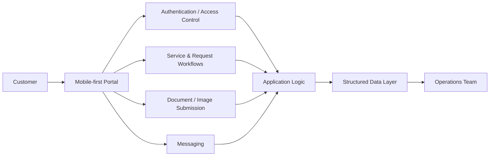

# Client Portal Application — Case Study

## Executive summary

A mobile-first customer portal designed to make onboarding, service access, document submission, messaging and progress visibility more structured.

The project sits at the intersection of customer experience and operations: the portal is both a customer-facing product and a mechanism for giving internal teams a clearer service workflow.

## The customer problem

When service interactions are spread across messages, forms, documents and manual follow-ups, customers can struggle to know:

- what information they need to provide;
- what happens next;
- whether a request has been received;
- what supporting documents are required;
- how to communicate with the service team;
- where a request currently stands.

The portal was designed to bring those interactions into one more coherent experience.

## My contribution

I led the:

- product and customer-journey thinking;
- information architecture;
- workflow design;
- interface direction;
- implementation;
- access-control approach;
- document and service-request flow;
- iteration around usability and operational needs.

## Product capability map

| Area | Role in the experience |
|---|---|
| Guided onboarding | Helps users provide the right information in sequence |
| Secure access | Restricts access to the appropriate user context |
| Service requests | Gives customers a structured way to initiate and track work |
| Document / image flow | Organises supporting information around the request |
| Messaging | Creates a more direct service communication channel |
| Status visibility | Makes progress and next steps easier to understand |
| Mobile-first interface | Prioritises real-world phone usage |

## High-level architecture

The production implementation is deliberately not reproduced here. The diagram communicates the product model without exposing private implementation details.

## Design decisions

### Make the next action obvious

The interface is organised around what the customer needs to do next rather than around internal organisational structure.

### Reduce repeated information requests

Structured flows help capture information once and make it available to the relevant process.

### Connect customer and operations workflows

The portal should not be a disconnected front end. Customer activity needs to translate into operational work that internal teams can act on.

### Build for mobile reality

A mobile-first approach prioritises readability, touch interaction, short flows and clear status over desktop-only presentation.

## Technology

- HTML
- CSS
- JavaScript
- Google Apps Script
- Google Sheets
- PHP

## What this project demonstrates

**customer problem → journey design → digital workflow → structured operations**

It demonstrates my ability to work across product thinking, customer experience and operational execution rather than treating interface design as a standalone task.

## Public / private boundary

The repository is a product case study. Production code, live customer records, credentials and proprietary business configuration are not published.

---

[Back to my portfolio](https://Nandwa254.github.io/)
